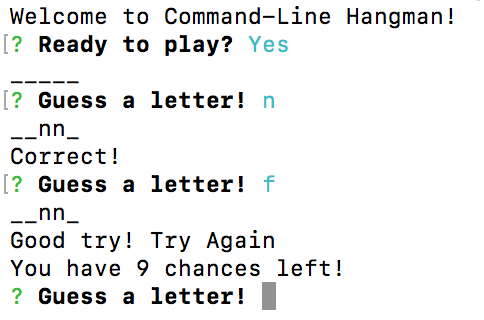

# Command Line Hangman

One page application to determine if restaurants in a given radius are open at the current moment.

## Screenshot

## Getting Started

Download my project and install inquirer from npm to get going!

### Prerequisites

npm [inquirer] (https://www.npmjs.com/package/inquirer)

### Technologies Used

Languages - HTML5, CSS3, Javascript, Node.js

Text Editor - VS Studio

## Contributing

Please feel free to branch off and make some tweaks and make a PR. Open to any cool suggestions!

## Future Development

* Remember time to completion and rank quickest times
* Add more words, maybe a better theme

## Authors

* **Robert Brown** - [Github](https://github.com/robertbernardbrown)
